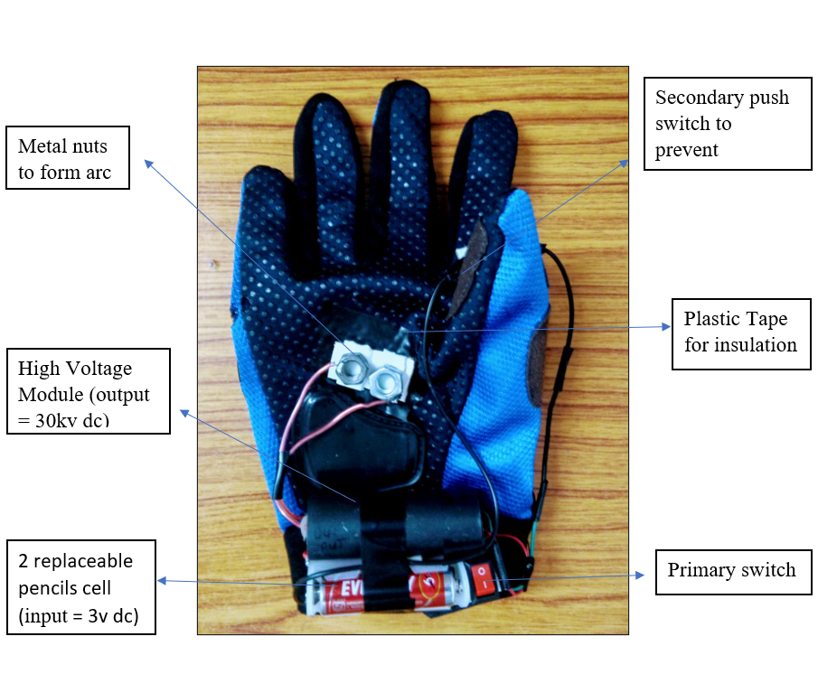
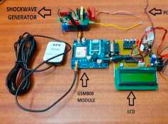
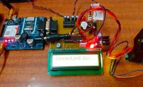

## Suraksha-Glove

## Youth Ideathon 2021

## Name - Ishaan Bhimwal

## School - Army Public School Pune

### Introduction

Women safety has always been an issue even in these modern times with so much advancement in technology. Women are not safe anywhere and are most vulnerable when traveling alone into lonely roads and deserted places.

According to a report by Thomson Reuters Foundation, India is ranked as a highly dangerous place for women worldwide, India has the greatest number of child brides as well. In 2016, the number of reported rapes is almost 39,000. Experts that were interviewed for the reason why India is presumed to be dangerous for women said India is on top of the list because its government has done almost nothing to provide safety to women since the rape and murder of a student in early 20’s in 2012 which prompted changes in the rape laws of the country. Most of the attacks on women happen when they are traveling alone or are in a remote area where they are not able to find any help or proper assistance.

Existing handheld devices that are available for women safety require women intervention to activate them such as pressing the button or shake the device etc after sensing the danger. However, for some reason if a woman has no time to activate it when she is danger, then the purpose of the safety device is not solved.

Suraksha glove proposes a smart solution to address the problem of women safety and that overcome the shortcomings of existing devices. The proposed design comprises of features to notify family members and nearby police station for immediate assistance when women are not safe. Moreover, a shock wave generator is a part of the proposed design which women can use to attack the perpetrator.

Some of the other features in the proposed work that provide additional support to women are as follows:

1. Sending group messages from the device as well as from the victim's phone.
2. Locating safe place from victim’s current location on the map.
3. Generating loud sound to inform nearby people for help.
4. Generating a 30kv charge for self-defence.

### Related Work

This section discusses the basic design of the women safety device. Suraksha glove is a stand-alone device which can be triggered in three ways either voice, switch, and shock/ force. Voice is the voice of victim. The device will recognize it and automatically send distress messages. Switch is a simple on/off trigger, and shock/force- whenever this device is thrown it will use force sensor to start functioning by giving the information of the location of the victim to her members of family and friends. It uses GPS and GSM modules to track the location and then send it to the family members and friend, alerting them about the current location of the woman. The device also allows the woman to trigger a loud buzzer on the receiving side of the message even if their device is in silent mode.

### Design for Women Safety Device

The women safety device provides assistance to a woman who might be in an unsafe situation. The device is essentially ready for all the situations that might go against the will of the woman. Fig.1 shows the hardware design of the safety device. Right now, the design comprises of a primary switch to activate the device, buzzer for alerting the environment, shock wave generator (a higher power module) for self-defence and a secondary push switch to prevent accidental shocks. It has 2 replaceable pencils cells.

Fig. 1. Working Hardware Design for Women Safety and Design of Shock Wave Generator (designed to be worn on the right hand)

Fig. 2. Proposed Hardware Design for Women Safety and GSM Module for sharing location (designed to be worn on the right hand)

The working of the device is as follows: The latitude and longitude data which is received by the GPS is delivered to both the LCD and the GSM modem which will forward the message to the woman’s family/friends. Thus, even if she is knocked down from behind and is not able to trigger an alert, the device will automatically send an emergency message to all the contacts listed by the woman as ICE contacts (In Case of Emergency contact) regarding the current location of the woman. The design also includes shock wave generator that acts as weaponry and helps woman to defend herself. Fig. 1 shows the hardware design of shock wave generator that comprises of a switch, transformer and wires. One of the two loose ends of the wires is the high voltage source and the other acts as the ground for a return path. As these loose ends are not in direct contact with each other, the high voltage is unable to arc- off unless it touches the attacker's body which acts as a conducting path between the two ends.
The circuit consists of three main stages

1. Power supply
2. Primary switch for powering the GSM Modules
3. Secondary switch for powering the High Voltage Module

### Results

This section presents the results of the experiments conducted with the proposed hardware design.

 

Fig. 3. Connecting with GSM Module Fig. 4. Message Received by Family Members/Police

As shown in Fig. 3, once the user activates the device, the continuous monitoring begins. The buzzer starts to beep, the GSM module sends message to all in case of emergency (ICE) numbers along with the latitude and longitude values which is taken from the GPS module as shown in Fig.4.
Incase the women wants to defend herself she can use the secondary push switch for powering the high voltage module.

### Conclusion

The main problem is that a women may not be able to both call for help or defend herself in a life-threatening situation. Also, there are already available products to tackle this problem like SOS feature in our smartphones and electric taser or defence sprays for women but these also come with there own problem. These devices that are available for women safety require manual intervention to activate them. However, for some reason if a woman has no time to activate it when she is danger, then the purpose of the safety device is not solved.

The Suraksha-Glove aims to provide comprehensive security. The glove can be activated in 3 ways. A buzzer is included in the design, so that any nearby person gets alerted about the mis-happening. Sending text messages ensure that close relatives and police gets alerted with the current location of victim. In case women feels need of self-defense she can make use of shockwave generator to temporarily incapacitate the perpetrator.

### Links

Video explanation -

<iframe width="560" height="315" src="https://www.youtube.com/embed/I0SYXqLJtDs" title="YouTube video player" frameborder="0" allow="accelerometer; autoplay; clipboard-write; encrypted-media; gyroscope; picture-in-picture"  style="max-width: 100%;" allowfullscreen></iframe>

Like and Share - 

Contact or Feedback - [Email](mailto:ishaanbhimwal07@gmail.com)
